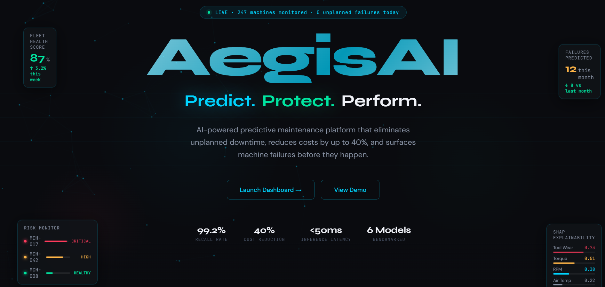
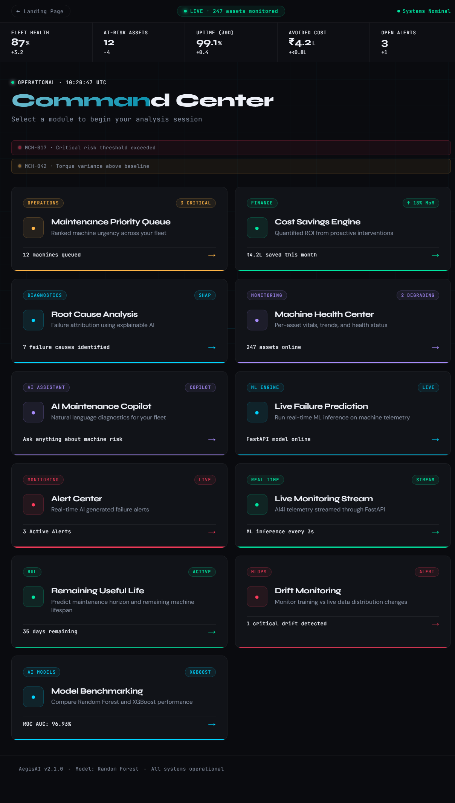
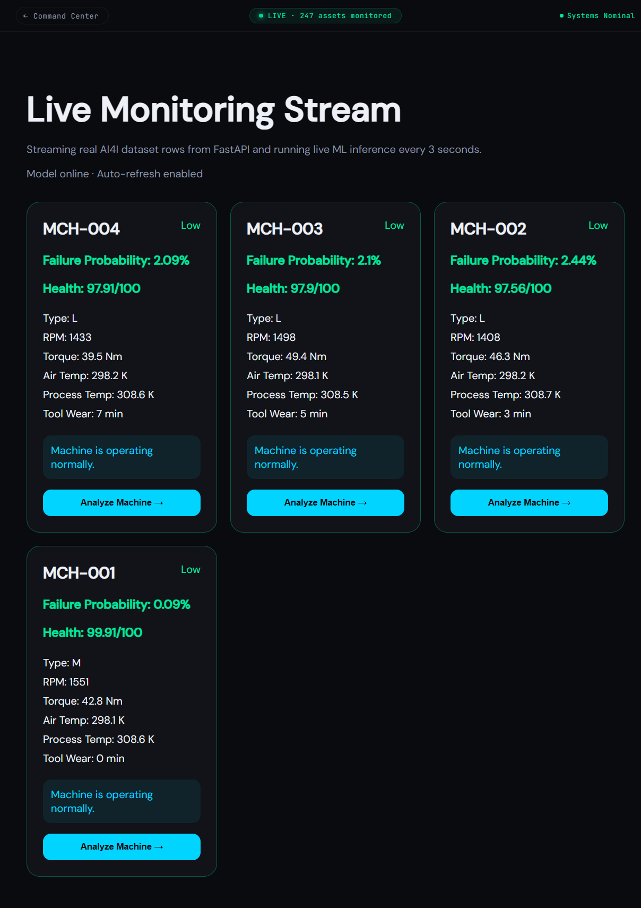
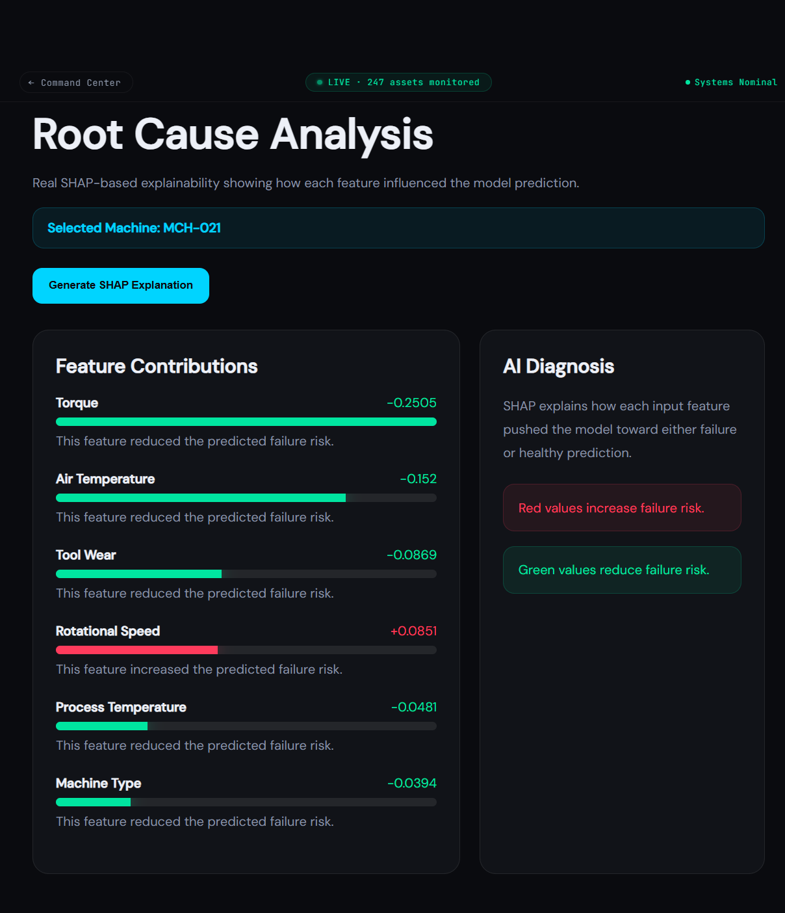
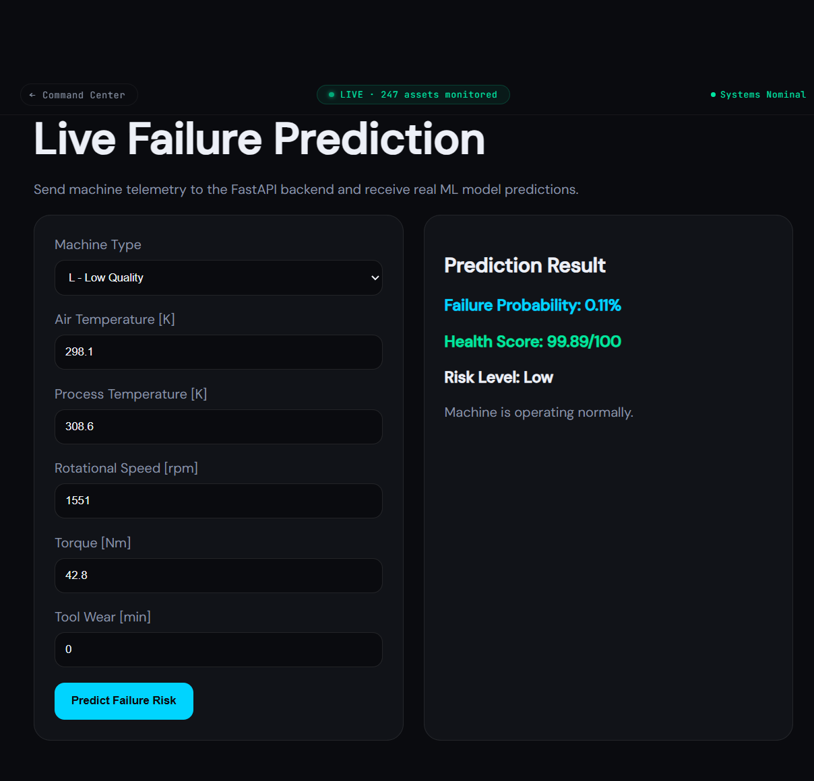
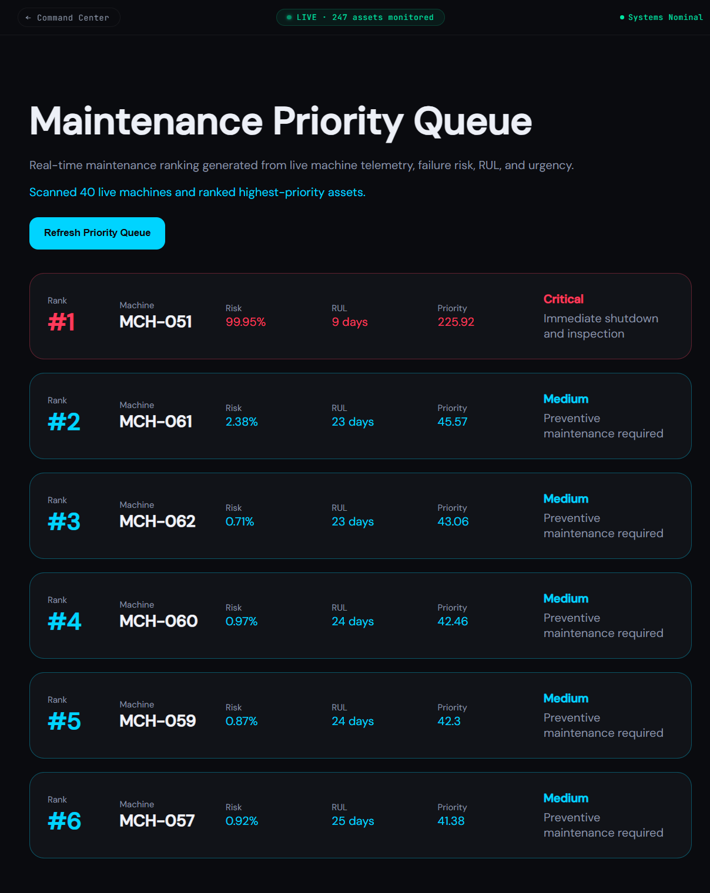

\# AegisAI — AI Predictive Maintenance Platform


AegisAI is a full-stack AI-powered predictive maintenance platform that helps monitor industrial machines, predict failure risk, estimate Remaining Useful Life, explain model decisions, rank maintenance priority, and estimate cost savings.


\## Live Demo


Frontend: https://aegisai-alpha.vercel.app/

Backend API Docs: https://aegisai-backend-b5m8.onrender.com/docs

Repository: https://github.com/riddhiravikumar19/aegisai

## Screenshots


\### Landing Page




\### Dashboard




\### Live Monitoring




\### Root Cause Analysis




\### Failure Prediction




\### Maintenance Priority Queue

## Features


\* Supabase Authentication

\* Real-time Machine Monitoring

\* Machine Failure Prediction

\* Machine Health Scoring

\* Remaining Useful Life Estimation

\* SHAP-based Root Cause Analysis

\* Maintenance Priority Queue

\* Cost Savings Engine

\* Alert Center

\* Model Benchmarking

\* AI Maintenance Copilot for maintenance recommendations

\* Deployed frontend and backend


\## Tech Stack


\### Frontend


\* React

\* Vite

\* React Router

\* Supabase Auth

\* CSS / Inline Styling

\* Vercel Deployment


\### Backend


\* FastAPI

\* Python

\* Scikit-learn

\* Pandas

\* Joblib

\* SHAP

\* Render Deployment


\### Machine Learning


\* Random Forest Classifier

\* XGBoost Benchmarking

\* AI4I 2020 Predictive Maintenance Dataset

\* Failure Probability Prediction

\* Remaining Useful Life Estimation

\* SHAP Explainability


\## Project Workflow


1\. User logs in using Supabase Authentication.

2\. Live machine telemetry is streamed from the backend.

3\. The ML model predicts failure probability and health score.

4\. RUL module estimates remaining useful life.

5\. SHAP explains root causes behind the prediction.

6\. Priority Queue ranks machines by risk and urgency.

7\. Cost Savings Engine estimates financial impact.

8\. Alert Center generates maintenance alerts.

9\. Copilot summarizes maintenance recommendations.


\## Setup Instructions


\### Clone the Repository


```bash

git clone https://github.com/riddhiravikumar19/aegisai.git

cd aegisai

```


\### Backend Setup


```bash

python -m venv venv

venv\\Scripts\\activate

pip install -r requirements.txt

uvicorn api.main:app --reload

```


Backend runs at:


```text

http://127.0.0.1:8000

```


\### Frontend Setup


```bash

cd frontend

npm install

npm run dev

```


Frontend runs at:


```text

http://localhost:5173

```


\## Environment Variables


\### Frontend


Create `frontend/.env`:


```env

VITE\_SUPABASE\_URL=your\_supabase\_project\_url

VITE\_SUPABASE\_ANON\_KEY=your\_supabase\_anon\_key

```


For local development:


```env

VITE\_API\_BASE\_URL=http://127.0.0.1:8000

```


For production:


```env

VITE\_API\_BASE\_URL=https://aegisai-backend-b5m8.onrender.com

```


`VITE\_API\_BASE\_URL` should point to your local FastAPI server during development and to the deployed Render backend in production.


\## Deployment


\* Frontend deployed on Vercel

\* Backend deployed on Render

\* Supabase used for authentication


\## Resume Summary


Developed and deployed AegisAI, a full-stack AI predictive maintenance platform using React, FastAPI, Supabase, and Random Forest models for real-time machine failure prediction, RUL estimation, SHAP explainability, priority maintenance ranking, and cost-savings analysis.


